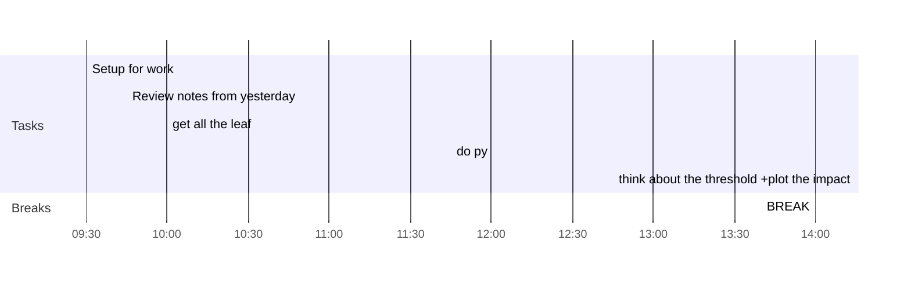

## Day Planner

## Day Planner 
This is my plan for the day broken into 3 main sections: 
1. Morning Prep 
2. Reading 
3. Afternoon Review 
### Morning 

Prep This is where I get ready for work and do my usual prep. 
- [x] 09:30 Setup for work
- [x] 09:45 Review notes from yesterday
- [x] 10:00 get all the leaf
- [x] 11:45 do py
- [x] 12:45 think about the threshold +plot the impact
- [x] 14:00 BREAK