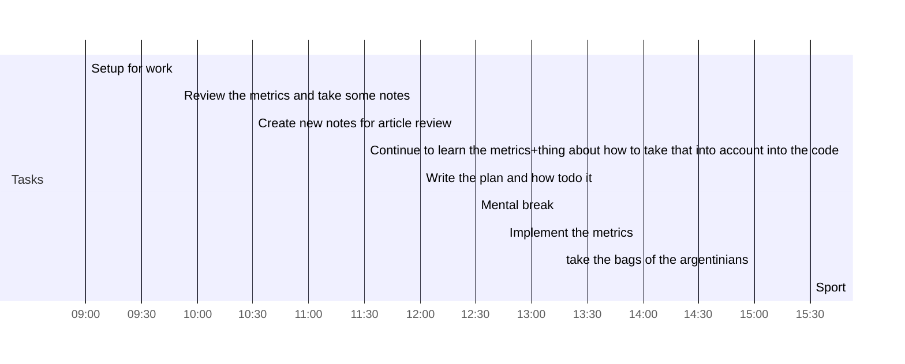

## Day Planner

- [x] 09:00 Setup for work
- [x] 09:50 Review the metrics and take some notes
- [x] 10:30 Create new notes for article review
- [x] 11:30 Continue to learn the metrics+thing about how to take that into account into the code
- [x] 12:00 Write the plan and how todo it
- [x] 12:30 Mental break
- [x] 12:45 Implement the metrics
- [ ] 15:00 take the bags of the argentinians
- [ ] 15:30 Sport
- [ ] 